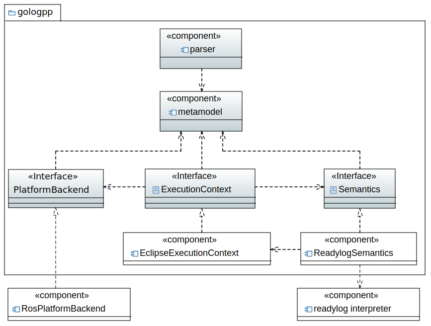

# golog++
golog++ is an implementation-independent GOLOG language.
Its main purpose is to provide a parser, a typesafe code model with static consistency checking, and a platform interface that is independent of the language semantics.

